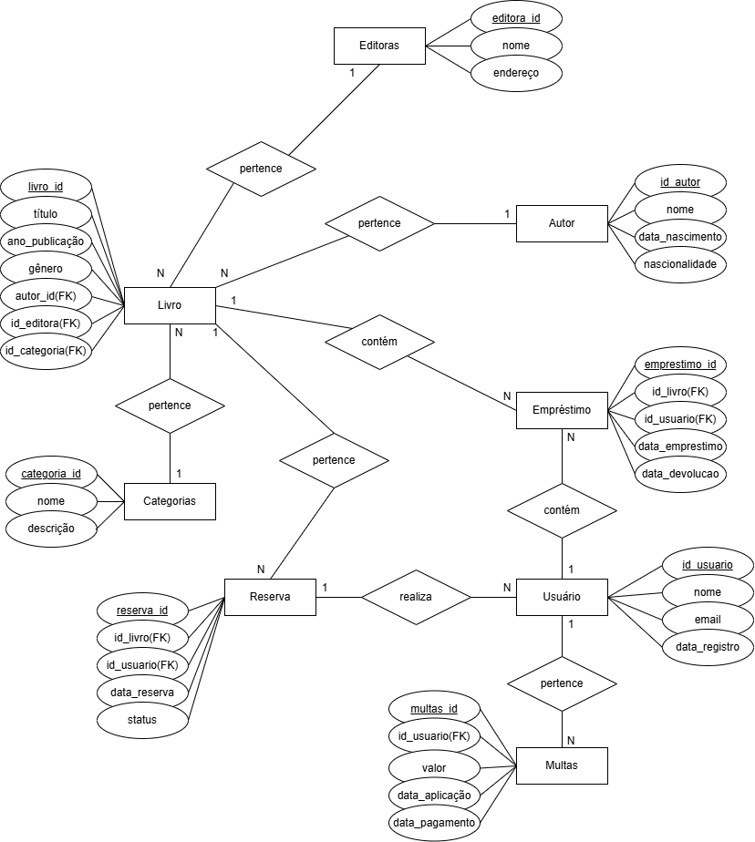

# Exercício de Fixação

## Sistema de Gerenciamento de Biblioteca
### Modelagem, Implementação SQL e CLI de Operações

## 1. Contexto do Problema
Você é um desenvolvedor de software contratado para projetar e implementar o banco de
dados de uma aplicação de gerenciamento de biblioteca pública. O sistema deve controlar o
acervo, os usuários, os empréstimos, reservas, multas, categorias e editoras.
O banco de dados deve contemplar as seguintes entidades:
• livros
○ título, ano de publicação, gênero e referência ao autor, editora e categoria
• autores
○ nome, data de nascimento e nacionalidade
• usuários
○ nome, e-mail e data de registro
• empréstimos
○ referência ao livro e ao usuário, data de empréstimo e data de devolução
• reservas
○ referência ao livro e ao usuário, data da reserva e status
• multas
○ referência ao usuário, valor, data de aplicação e data de pagamento
• categorias
○ nome e descrição
• editoras
○ nome e endereço

## Modelo Conceitual:

## Modelo Lógico:
### autor
autor_id → SERIAL (PK)  
nome → VARCHAR(100) NOT NULL  
data_nascimento → DATE  
nacionalidade → VARCHAR(50)  
___

### editora
editora_id → SERIAL (PK)  
nome → VARCHAR(100) NOT NULL  
endereco → VARCHAR(150)  
___

### categoria
categoria_id → SERIAL (PK)  
nome → VARCHAR(100) NOT NULL  
descricao → TEXT  
___

### livro
livro_id → SERIAL (PK)  
titulo → VARCHAR(150) NOT NULL  
ano_publicacao → INT  
genero → VARCHAR(50)  
autor_id → INT (FK)  
editora_id → INT (FK)  
categoria_id → INT (FK)  
___

### usuario
usuario_id → SERIAL (PK)  
nome → VARCHAR(100) NOT NULL  
email → VARCHAR(100) UNIQUE NOT NULL  
data_registro → DATE NOT NULL  
___

### emprestimo
emprestimo_id → SERIAL (PK)  
livro_id → INT (FK)  
usuario_id → INT (FK)  
data_emprestimo → DATE NOT NULL  
data_devolucao → DATE  
___

### reserva
reserva_id → SERIAL (PK)  
livro_id → INT (FK)  
usuario_id → INT (FK)  
data_reserva → DATE NOT NULL  
status → VARCHAR(20)  
___

### multa
multa_id → SERIAL (PK)  
usuario_id → INT (FK)  
valor → DECIMAL(10,2) NOT NULL  
data_aplicacao → DATE NOT NULL  
data_pagamento → DATE  
___

## Modelo Físico:
### PostgreSQL utilizando o pgAdmin 4

CREATE TABLE bd_autor (
	autor_id SERIAL PRIMARY KEY,
	nome VARCHAR(100) NOT NULL,
	data_nascimento DATE,
	nacionalidade VARCHAR(50) 
);

CREATE TABLE bd_editora (
	editora_id SERIAL PRIMARY KEY,
	nome VARCHAR(100) NOT NULL,
	endereço VARCHAR(150)
);

CREATE TABLE bd_categoria (
	categoria_id SERIAL PRIMARY KEY,
	nome VARCHAR(100) NOT NULL,
	descricao TEXT
);

CREATE TABLE bd_usuario (
	usuario_id SERIAL PRIMARY KEY,
	nome VARCHAR(100) NOT NULL,
	email VARCHAR(100) UNIQUE NOT NULL,
	data_registro DATE NOT NULL
);

CREATE TABLE bd_livro (
	livro_id SERIAL PRIMARY KEY,
	titulo VARCHAR(150) NOT NULL,
	ano_publicacao INT,
	genero VARCHAR(50),
	
	autor_id INT NOT NULL,
	editora_id INT NOT NULL,
	categoria_id INT NOT NULL,

	FOREIGN KEY(autor_id) REFERENCES bd_autor(autor_id),
	FOREIGN KEY(editora_id) REFERENCES bd_editora(editora_id),
	FOREIGN KEY(categoria_id) REFERENCES bd_categoria(categoria_id)
);

CREATE TABLE bd_emprestimo (
	emprestimo_id SERIAL PRIMARY KEY,
	livro_id INT NOT NULL,
	usuario_id INT NOT NULL,
	data_emprestimo DATE NOT NULL,
	data_devolucao DATE,

	FOREIGN KEY(livro_id) REFERENCES bd_livro(livro_id),
	FOREIGN KEY(usuario_id) REFERENCES bd_usuario(usuario_id)
);

CREATE TABLE bd_reserva (
	reserva_id SERIAL PRIMARY KEY,
	livro_id INT NOT NULL,
	usuario_id INT NOT NULL,
	data_reserva DATE NOT NULL,
	status VARCHAR(20) NOT NULL,

	FOREIGN KEY(livro_id) REFERENCES bd_livro(livro_id),
	FOREIGN KEY(usuario_id) REFERENCES bd_usuario(usuario_id)
);

CREATE TABLE bd_multa (
    multa_id SERIAL PRIMARY KEY,
    usuario_id INT NOT NULL,
    valor DECIMAL(10,2) NOT NULL,
    data_aplicacao DATE NOT NULL,
    data_pagamento DATE,

    FOREIGN KEY (usuario_id) REFERENCES bd_usuario(usuario_id)
);

